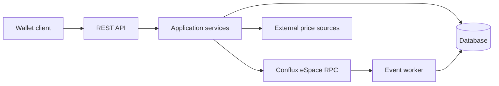

# Architecture

## System Context

Fluent Backend provides REST APIs for browser-extension wallets on Conflux eSpace. It validates and sponsors transactions and UserOperations, reads contract state through RPC, persists finalized sponsorship events, and retrieves external market prices for token-denominated gas payment.



The wallet owns and signs user transactions. The backend owns only its configured sponsor signer and must not act as a custodian for user keys.

## Module Boundaries

- `cmd/` is the composition root. It loads configuration, opens the database, creates services, starts eligible workers, and starts the HTTP server.
- `api/` owns transport concerns: routes, request binding, response models, middleware, and Swagger annotations. Controllers delegate business decisions to services.
- `service/` owns validation, signing, sponsorship policy, pricing, and chain-facing workflows.
- `store/` owns persistence models and database operations. Business policy should not be embedded in store methods.
- `worker/` owns long-running blockchain synchronization. Workers use services or stores but do not expose HTTP behavior.
- `contract/` contains contract ABIs, generated bindings, and handwritten encoding or contract helpers. It does not own application policy.

Dependencies should normally flow from `cmd` into `api`, `service`, `store`, and `worker`; from `api` into `service`; and from `service` or `worker` into `store`, `contract`, and external clients. Keep HTTP-specific types out of persistence and contract helpers.

## Runtime Composition

`cmd/start.go` performs startup in this order:

1. Load API, service, worker, and store configuration.
2. Open the database and construct the project store.
3. Create the shared RPC client and application services.
4. Start the UserOperation event worker when Verifying Paymaster is enabled.
5. Register routes for non-nil services and start the API server.

Optional features are configuration-driven:

| Component | Enablement requirement |
| --- | --- |
| Account Abstract | Delegated contract address |
| Verifying Paymaster | Paymaster address and both smart-account and contract whitelists |
| Price Oracle | At least one USDT-family token |
| Gas Tank | Price Oracle and Gas Tank paymaster address |
| Token Pay | Price Oracle and payment recipient |
| UserOperation event worker | Verifying Paymaster service |

A disabled optional service remains nil. Its routes and dependent workers must not be registered.

## Request and Background Flows

Synchronous requests follow this path:

```text
route and middleware -> controller -> service -> RPC, contract binding, or store
```

Controllers translate HTTP input and output. Services enforce business and security rules before signing, submitting, or returning chain-related data.

The Verifying Paymaster background path is separate:

```text
finalized chain events -> UserOperation event worker -> store -> sponsorship limits and reporting
```

The worker processes finalized events rather than signing requests because a signed UserOperation may never be submitted. Its database checkpoint controls where scanning resumes.

## External Dependencies

- Conflux eSpace RPC supplies chain state, transaction submission, receipts, contract calls, and finalized event logs.
- Configured contracts define account, paymaster, and ERC20 behavior used through bindings in `contract/`.
- Binance and OKX supply runtime market prices used by the Price Oracle.
- The configured GORM database stores application state, UserOperation events, and worker checkpoints.

Treat these boundaries as fallible. Keep network-dependent behavior out of unit tests unless a test is explicitly designed as an integration test.

## Related Documentation

- [Project setup](../README.md)
- [Gas Tank](features/gas-tank.md)
- [Token Pay](features/token-pay.md)
- [Verifying Paymaster](features/verifying-paymaster.md)
